# D'Pras Barbershop — aplikasi operasional

Aplikasi web untuk barbershop + nail salon dalam satu lokasi: jadwal, kasir, deposit, inventaris, komisi, SOP.

- **Tahap 0 — fondasi:** skema database lengkap (Fase 1–3), RLS per peran, RPC atomik, logika bisnis + test,
  login 4 peran, **Pengaturan**, landing & booking online publik.
- **Tahap 1 — konter:** **Beranda manajer**, **Jadwal** (grid per kursi, booking cepat, bentrok), **Kasir**
  (tagihan booking, katalog, deposit, kembalian, struk, riwayat & void, tutup kasir), **Pelanggan** (profil,
  follow-up, impor CSV/Excel). Semua realtime antar-perangkat.
- **Tahap 2 — aplikasi kapster** (`/kapster`, PWA "G&B Kapster"): antrean 3 ketukan, preferensi pelanggan,
  timer, jadwal 7 hari, komisi saya, izin/cuti (+ persetujuan manajer di `/manajer/izin`), notifikasi realtime &
  Web Push, "siap bayar" di konter, dan **mode stasiun** (tablet bersama, masuk dengan PIN).
- **Tahap 3 — wajah publik:** landing yang seluruh isinya dari **Pengaturan → Halaman publik** (ISR, SEO,
  OpenGraph, sitemap, JSON-LD), booking online 4 langkah dengan aturan jam/libur/izin/buffer, kode booking, file
  kalender (.ics), mode tinjau, captcha, akun pelanggan (jadwal ulang, batal, profil, lupa sandi, hapus akun),
  notifikasi toko, antrean email/WhatsApp + pengingat H-1, halaman kebijakan privasi, dan corong konversi di Beranda.
- **Tahap 4 — inventaris & SDM:** **Inventaris** (stok masuk dengan harga pokok rata-rata tertimbang, penyesuaian
  beralasan, resep HPP & margin, stok opname lintas perangkat, mutasi, pemasok, daftar belanja → WhatsApp, laporan
  pemakaian teoretis vs aktual) dan **SDM & Komisi** (komisi hibrida + ritel + jaring pengaman dari satu fungsi,
  bonus/potongan, tutup periode gaji, slip A5/WhatsApp, status bayar, peringkat, evaluasi tahunan). Lonceng
  notifikasi realtime di menu admin.
- **Tahap 5 — analitik & kepatuhan:** **Analitik KPI** (AOV per kategori vs target, utilisasi kursi/meja, rasio
  ritel, peta panas, selisih durasi, pelanggan & follow-up, booking online, insight otomatis, ekspor CSV, laporan
  bulanan PDF) dan **SOP & Kepatuhan** (checklist sterilisasi 3 tahap per shift, otorisasi, riwayat, pengingat,
  perawatan fasilitas berkala khusus manajer, laporan kepatuhan siap cetak) + tab **SOP** (checklist sterilisasi) di
  aplikasi kapster. Navbar atas
  admin berisi lonceng notifikasi.

**Stack:** Next.js 16 (App Router, TypeScript strict) · Tailwind CSS 4 · Supabase (Postgres, Auth, RLS, Realtime) · Zod · Vitest · pgTAP · Vercel.

## Menjalankan di lokal

Butuh: Node.js 22 (lihat `.nvmrc`; Node 20 masih jalan tapi sudah deprecated untuk supabase-js) dan Docker
(Docker Desktop, OrbStack, atau Colima).

```bash
npm install
npx supabase start                 # Postgres + Auth + Realtime lokal di Docker (pertama kali: unduh image)
npx supabase status -o env         # salin API_URL, PUBLISHABLE_KEY, SECRET_KEY ke .env.local (lihat .env.example)
npm run db:reset                   # bangun ulang skema + seed
npm run dev                        # http://localhost:3000
```

Studio (lihat isi DB): http://127.0.0.1:54323 · Email lokal (Mailpit): http://127.0.0.1:54324

### Akun demo (hanya lokal, sandi `kOVAJu-ppxv7d-xpOT5w-qVBV1S`)

| Peran | Email | Masuk ke |
|---|---|---|
| Manajer | manajer@groombloom.test | `/login` → `/manajer` |
| Kasir | kasir@groombloom.test | `/login` → `/kasir/kasir` |
| Kapster (Andi, Sari) | andi@groombloom.test, sari@groombloom.test | `/login` → `/kapster` |
| Pelanggan (Rina) | rina@groombloom.test | `/akun` |

Kode undangan tim lokal: `GB-2026` (diset `seed-demo.sql`; di produksi kode bawaan acak). Pendaftaran akun baru
(pelanggan & tim) wajib konfirmasi email — di lokal emailnya masuk ke Mailpit: http://127.0.0.1:54324. Web Push lokal memakai kunci di `.env.local`; trigger DB memanggil
`http://host.docker.internal:3000/api/push` (`npm run dev`).

## Perintah

| Perintah | Isi |
|---|---|
| `npm run dev` / `build` / `start` | Next.js |
| `npm run typecheck` · `npm run lint` | TypeScript & ESLint |
| `npm test` | Unit test logika bisnis (`src/lib/domain`) |
| `npm run test:db` | Tes pgTAP: RLS per peran, checkout, booking dobel, void, tutup kasir, impor, harga pokok, opname, komisi & periode gaji, definisi KPI, SOP & perawatan (`supabase/tests`). Butuh data seed segar: jalankan `npm run db:reset` dulu |
| `npm run test:e2e` | Playwright: 5 alur konter + 5 alur kapster di 1366×768, 1024×768, 820×1180, 390×844, alur publik & tes konkurensi booking di 390×844, 6 alur inventaris & gaji (E1–E6) dan 8 alur analitik & SOP (E1–E8) di 1366/1024/820, plus tes kinerja 12 bulan data (terakhir, di 390×844). **Me-reset DB lokal** (`E2E_SKIP_RESET=1` untuk melewati); build & jalan di port 3100 |
| `npm run test:lighthouse` | Lighthouse mobile untuk `/` dan `/booking` (median 3×, gagal bila ada kategori < 90). Jalankan server produksi di port 3100 dulu |
| `npm run db:reset` | Terapkan ulang migrasi + seed |
| `npm run seed:analytics` | **Opsional**: tambah riwayat 12 bulan (±10.000 transaksi) untuk mencoba Analitik. Jalankan sesudah `db:reset`; hanya untuk lokal/demo |
| `npm run db:types` | Generate ulang `src/lib/supabase/database.types.ts` setelah mengubah skema |

Membuat perubahan skema: `npx supabase migration new <nama>`, tulis SQL, lalu `npm run db:reset && npm run db:types && npm run test:db`.

## Panduan harian kasir

Kasir masuk di `/login` dan langsung mendarat di **Kasir**. Menu kasir hanya Jadwal, Kasir, Pelanggan.
Semua layar tersinkron otomatis antar-perangkat (tablet kasir, laptop manajer, HP kapster). Jika muncul pita
merah **"Koneksi terputus"**, tunggu sampai tersambung — tombol simpan & bayar dinonaktifkan sementara.

**1. Tamu datang / telepon → booking** (Jadwal). Ketuk kotak kosong di kolom kursi & jam yang diinginkan.

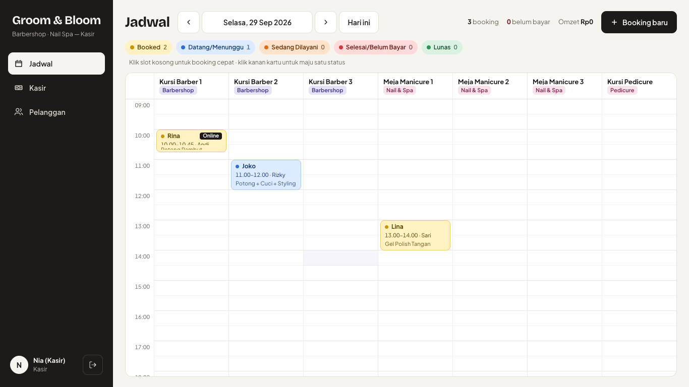

Cari pelanggan lama (ketik nama atau no. WA), atau isi nama + WA pelanggan baru (kosongkan nama untuk walk-in).
Ketuk layanan (boleh barbershop + nail sekaligus), lalu **Simpan booking**. Jika jadwal bentrok muncul peringatan
kuning — booking tetap bisa disimpan dengan **Tetap simpan**, dan kartunya diberi label *Bentrok*.

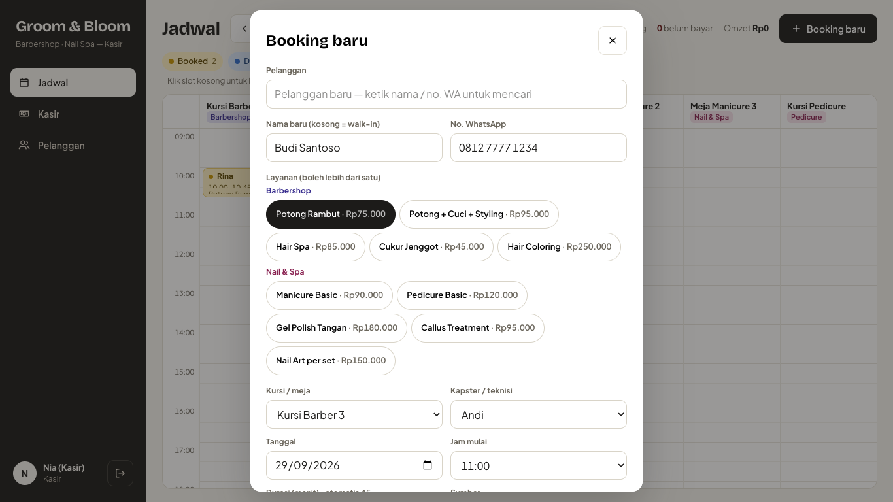

**2. Layani.** Ketuk kartu booking → ubah status: **Datang → Mulai → Selesai** (boleh mundur untuk koreksi).
Preferensi pelanggan (ukuran clipper, warna gel, alergi) tampil di panel ini. Di laptop, klik kanan kartu
(di tablet: tahan) untuk maju satu status tanpa membuka panel.

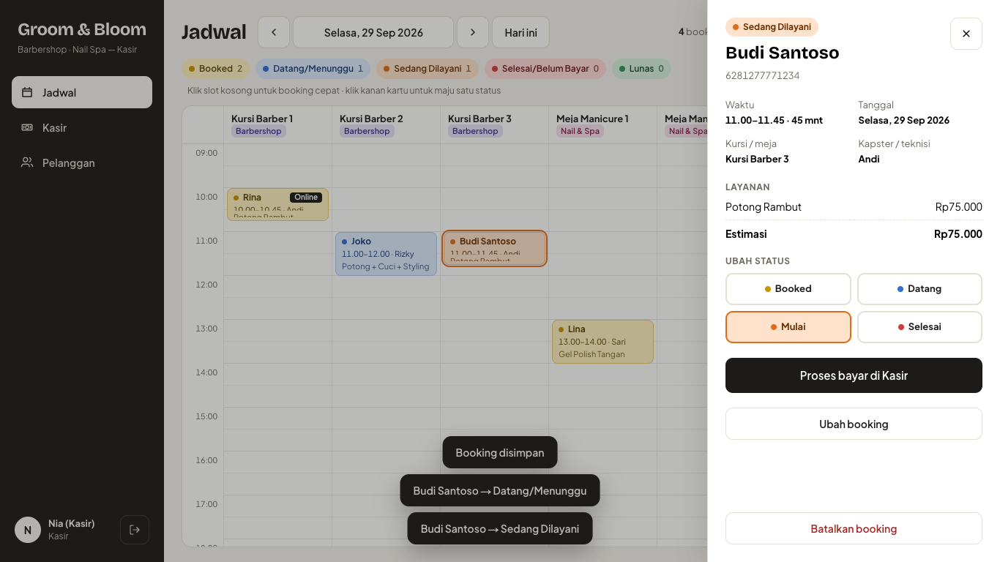

**3. Bayar.** Ketuk **Proses bayar di Kasir** (atau buka Kasir dan ketuk kartu di *Tagihan dari booking hari
ini* — pasangan yang datang bareng: ketuk kedua kartunya). Pastikan tiap layanan punya kapster (dasar komisi).
Diskon paket muncul otomatis bila ada layanan barbershop **dan** nail. Tawarkan saran upsell (bintang ★).
Pilih **Pakai saldo deposit** bila pelanggan punya saldo. Tunai: ketuk nominal cepat untuk melihat kembalian.
Ketuk **Catat pembayaran**.

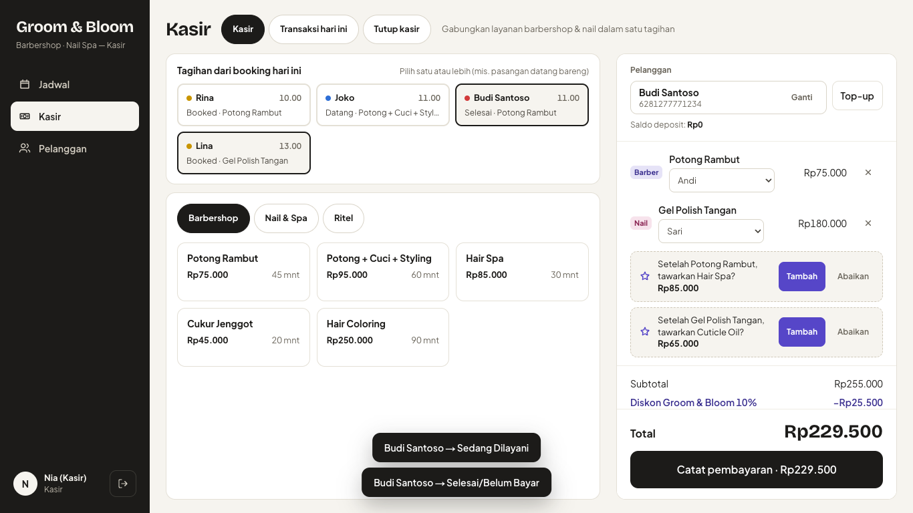

Setelah tercatat, kirim struk lewat **WhatsApp** atau **Cetak** (pilih kertas 58/80 mm), lalu **Transaksi baru**.

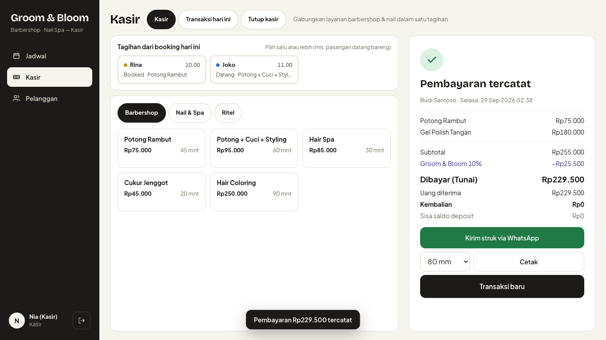

**4. Top-up deposit.** Di keranjang (pelanggan dipilih) atau di profil pelanggan → **Top-up** → pilih paket
(mis. bayar 1.000.000 → saldo 1.125.000) atau isi nominal manual → Tunai/QRIS → **Simpan top-up**.

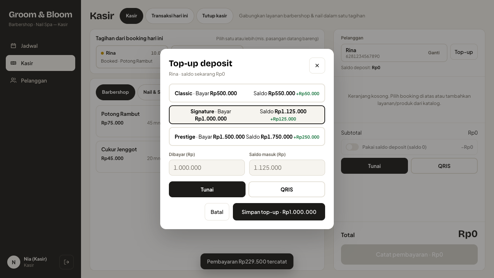

**5. Salah input?** Kasir → *Transaksi hari ini* → ketuk transaksi untuk melihat & kirim ulang struk.
Pembatalan (void) hanya bisa oleh **manajer**, wajib alasan; booking kembali ke *Selesai/Belum Bayar* dan stok
serta saldo deposit dikembalikan.

**6. Tutup kasir (akhir hari).** Kasir → *Tutup kasir*. Hitung uang di laci, isi **Kas fisik** — selisih terhadap
*Kas diharapkan* (tunai penjualan + tunai top-up) langsung terlihat. **Simpan tutup kasir**, lalu **Cetak / simpan
PDF** untuk dicocokkan dengan buku kas lama.

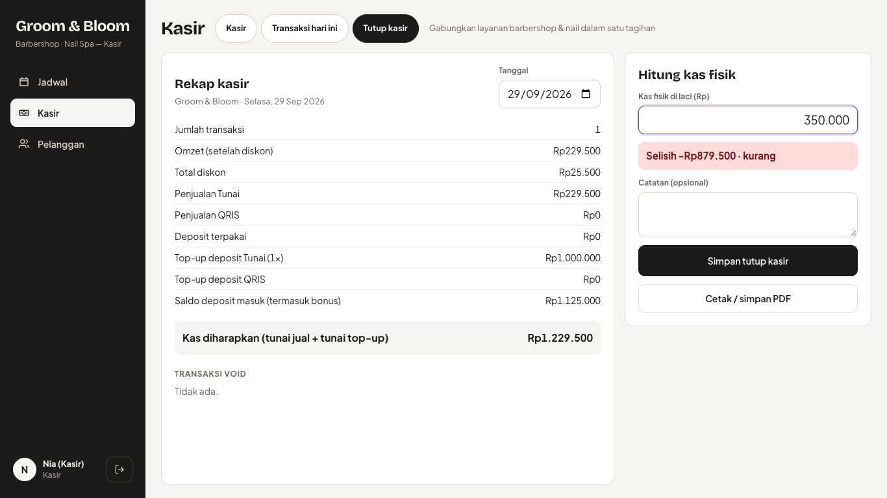

**7. Pelanggan.** Cari nama/WA, filter *Perlu follow-up* (belum kembali > N minggu, atur di Pengaturan).
Di profil: ubah nama/WA, catatan preferensi (tersimpan otomatis), **Kirim WhatsApp follow-up**, **Top-up saldo**,
**Buat booking**, riwayat transaksi, dan mutasi deposit. Manajer bisa **Impor** pelanggan lama dari CSV/Excel
(kolom `nama`, `whatsapp`, `catatan`; unduh contoh file di dialog impor) — duplikat & error ditampilkan sebelum disimpan.

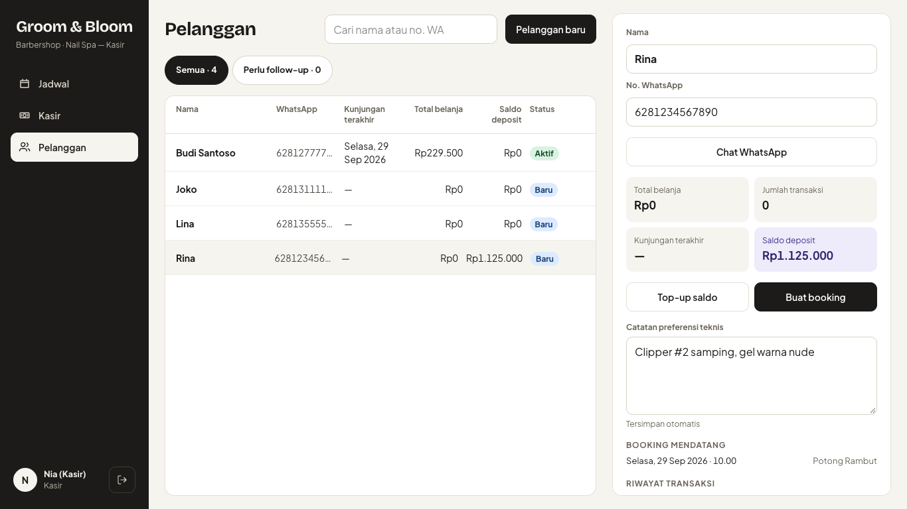

**Manajer** mendarat di **Beranda**: omzet, booking, yang sedang dilayani, tagihan belum bayar, follow-up, tim
hari ini, dan booking berikutnya.

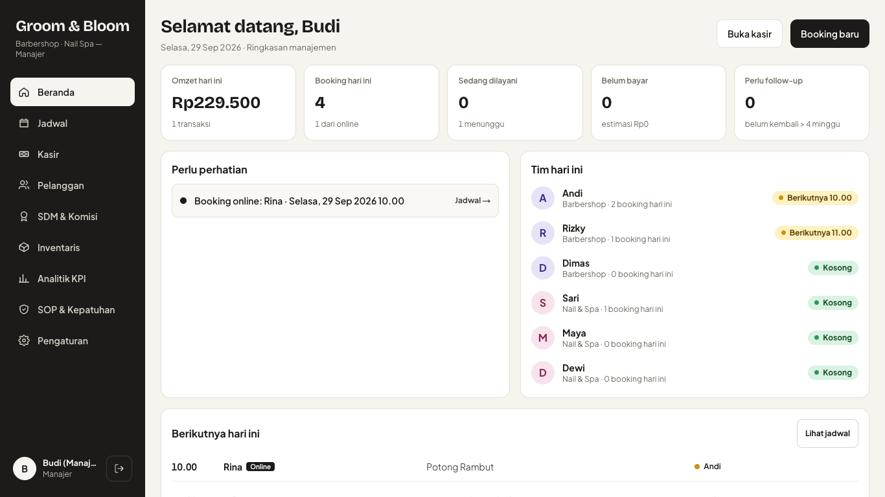

## Panduan kapster & nail artist

**Pasang di HP (sekali saja).** Buka `https://<domain>/login` di HP, masuk dengan akun Anda → langsung ke
**Hari ini**. Lalu:
- **Android (Chrome):** menu ⋮ → **Instal aplikasi** / *Tambahkan ke layar utama* → muncul ikon **G&B Kapster**.
- **iPhone (Safari):** tombol Bagikan → **Tambahkan ke Layar Utama**.

Ketuk ikon lonceng 🔔 di header → **Notifikasi push** untuk menerima pemberitahuan booking baru walau aplikasi
ditutup (iPhone: harus dari ikon di layar utama, iOS 16.4+). Bunyi notifikasi bisa dimatikan di menu yang sama.
Selama tab **Hari ini** terbuka, layar HP dijaga tetap menyala.

**Alur 3 ketukan per pelanggan (tab Hari ini).** Kartu besar selalu menampilkan pelanggan yang sedang dilayani
atau berikutnya — lengkap dengan preferensi (kotak ungu), catatan booking, dan 3 kunjungan terakhir dengan Anda.
1. **Pelanggan datang** (biru) — konter langsung melihat pelanggan sudah datang.
2. **Mulai layanan** (hitam) — timer berjalan; merah jika melewati durasi.
3. **Selesai → ke kasir** (hijau) — kasir mendapat notifikasi *"siap bayar"*. Kartu pindah ke antrean berikutnya.

Salah ketuk? **Batalkan status terakhir** tersedia 10 menit setelah Anda mengubah status (satu langkah). Lewat dari
itu, minta kasir mengoreksi. Tulis preferensi baru (ukuran clipper, warna gel, alergi) di kolom **Perbarui
preferensi** — tersimpan otomatis. Ketuk baris di *Semua jadwal saya hari ini* untuk melihat pelanggan lain.

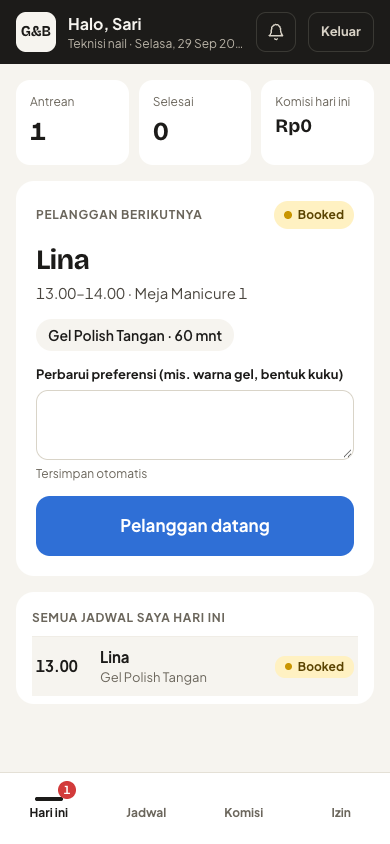

**Jadwal** menampilkan 7 hari ke depan (hanya baca). Perlu ganti jam? Ketuk **Minta ubah jadwal** dan tulis
pesannya — kasir mendapat notifikasi dan memindahkan booking. **Komisi** menampilkan perkiraan bulan berjalan
(angka final ditetapkan manajer).

**Izin & cuti.** Menu **⋯** (kanan atas) → **Izin / cuti** → pilih *Sehari penuh* (bisa beberapa hari) atau *Rentang jam* → isi alasan →
**Ajukan izin**. Status muncul di daftar *Pengajuan saya*; pengajuan yang masih *Menunggu* bisa dibatalkan.
Setelah manajer menyetujui (di **Izin staf**), Anda tidak ditawarkan di booking online pada waktu itu dan kasir
mendapat peringatan bila memilih Anda. Booking yang sudah ada di rentang izin ditampilkan ke manajer untuk dipindahkan.

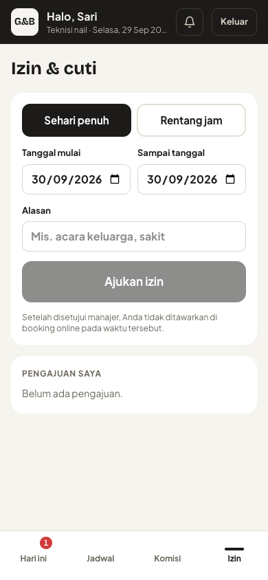

**Tablet bersama (mode stasiun).** Manajer: di tablet itu buka **Pengaturan → Stasiun & PIN**, atur PIN tiap
kapster (4–6 digit) dan ketuk **Daftarkan perangkat ini**, lalu keluar. Tablet dibuka di `/stasiun`: kapster
ketuk namanya → PIN → tab Hari ini miliknya. **Ganti kapster** selalu terlihat; sesi keluar otomatis setelah
5 menit tanpa aktivitas. 5× PIN salah → terkunci 5 menit. Perangkat bisa dicabut dari Pengaturan kapan saja.

## Panduan manajer: inventaris & gaji

Semua ada di **Inventaris** dan **SDM & Komisi** (hanya manajer). Stok selalu = jumlah seluruh mutasi; setiap
perubahan tercatat siapa, kapan, alasan, dan referensinya (tab **Mutasi**, bisa diekspor CSV).

### Stok masuk (belanja datang)

1. **Inventaris → + Stok masuk** (atau tombol di baris item / chip merah di banner atas).
2. Pilih item, isi **jumlah** dan **harga beli per satuan** — atau centang *total harga nota* dan isi totalnya,
   harga per satuan dihitung otomatis. Pilih pemasok, no. nota, dan (opsional) foto nota.
3. Cek pratinjau, mis. *Stok 450 → 1.450 ml · harga pokok Rp120 → Rp130,34*, lalu **Simpan**.

Harga pokok diperbarui otomatis (rata-rata tertimbang; bisa diganti "harga beli terakhir" di **Pengaturan → Umum → Inventaris**, bersama ambang margin, ambang selisih pemakaian, dan pengali saran beli)
dan **hanya berlaku untuk transaksi berikutnya** — HPP transaksi lama tetap. Koreksi salah input harga lewat
menu **⋯ → Penyesuaian harga pokok** (wajib alasan). Barang rusak/kedaluwarsa/tumpah: **⋯ → Penyesuaian stok**.
Item yang sudah punya riwayat tidak bisa dihapus — **⋯ → Nonaktifkan**.

### Daftar belanja

Item **Reorder** (merah, ≤ ambang) & **Menipis** (kuning, ≤ 1,5× ambang) muncul di banner, badge menu Inventaris,
lonceng, dan Beranda. **Daftar belanja** mengelompokkan item per pemasok dengan saran jumlah (sampai 2× ambang,
dibulatkan ke kelipatan minimal order bila diisi). Ubah jumlah bila perlu → **Kirim via WhatsApp** (pesan siap
kirim ke nomor pemasok), **Salin daftar**, atau **Cetak**. Nomor WA & item per pemasok diatur di tab **Pemasok**
dan kolom *Pemasok* di tab Bahan/Ritel.

### Stok opname bulanan

1. **Stok Opname → Mulai opname**, pilih cakupan (Bahan HPP / Ritel / Semua). Angka sistem dibekukan saat mulai.
2. Hitung rak: isi jumlah fisik (tombol −/+ untuk koreksi cepat). Selisih langsung terlihat (merah kurang,
   hijau lebih). **Simpan sebagian** kapan saja; kasir bisa membantu dari menu **Stok opname** di tablet konter
   (tanpa melihat harga), manajer melanjutkan dari perangkat lain.
3. Cek ringkasan (jumlah dihitung, total nilai selisih, selisih terbesar) → **Setujui opname**. Hanya item yang
   dihitung dan berselisih yang menjadi mutasi *Opname*; yang dikosongkan tidak diubah.
4. **Laporan Pemakaian**: pilih dua opname yang disetujui → pemakaian teoretis (layanan terjual × resep) vs aktual
   (stok awal + masuk + penyesuaian − stok akhir − terjual). Baris di atas ambang (default 10%) ditandai —
   bisa berarti pemborosan, bahan tercecer, atau resep kurang akurat.

### Mengatur resep & margin

**Resep HPP** → pilih layanan (chip *Margin rendah* bila di bawah 60%) → atur bahan & jumlah pakai → **Simpan
resep**. Kartu ringkasan menampilkan harga, HPP, margin kotor, komisi staf, dan **laba kontribusi toko**.
**Riwayat perubahan** menyimpan resep sebelum/sesudah. Tabel *Margin semua layanan* diurutkan dari margin terendah.

### Tutup gaji bulanan & slip

1. **SDM & Komisi → Gaji bulanan**: pilih bulan (‹ ›). Tabel per staf: layanan, pendapatan, HPP, komisi jasa,
   komisi ritel, subsidi jaring pengaman, penyesuaian, **total dibayar**. Klik staf untuk rincian, grafik 6 bulan,
   dan **Tambah bonus/potongan** (alasan wajib).
2. Awal bulan berikutnya (Beranda mengingatkan): **Tutup periode** → cek pratinjau → *Tutup & bekukan angka*.
   Angka menjadi final (tab Komisi kapster menampilkan **Final**), dan void transaksi bulan itu dikunci.
3. Buka **Slip** per staf → **Cetak / PDF** (A5), **Kirim via WhatsApp**, lalu **Tandai sudah dibayar**
   (tanggal & metode). **Ekspor rekap** memberi CSV satu baris per staf (bisa dibuka di Excel).
4. Salah hitung setelah ditutup? **Buka ulang** (alasan wajib, tercatat) → koreksi/void → tutup lagi. Snapshot &
   status bayar dibuat ulang.

**Aturan komisi** (tab tersendiri): rasio global 20–60%, rasio khusus per staf, komisi ritel untuk staf penjual
(pilih *Dijual oleh* di kasir), dan ambang gaji minimum. Rumus: per layanan `round(max(0, harga bersih − HPP) × rasio)`;
subsidi = `max(0, ambang − komisi)` dihitung **sebelum** bonus/potongan. **Produktivitas** menampilkan peringkat
bulan/tahun; **Evaluasi tahunan** berisi pendapatan, rata-rata, tingkat upsell, pelanggan kembali ≤60 hari,
hari kerja/izin, total dibayar, dan kolom catatan manajer untuk keputusan bonus (bisa diekspor).

## Membaca dashboard KPI & insight

**Analitik KPI** (manajer) menjawab tiga pertanyaan: berapa yang masuk, dari mana, dan apa yang perlu diperbaiki.

1. **Pilih periode** di atas: Hari ini · 7 hari · 30 hari · Bulan ini · Bulan lalu · rentang khusus, lalu (opsional)
   **Kategori** dan **Staf**. Pilihan tersimpan di alamat halaman — bisa di-bookmark atau dikirim. Di bawahnya tertulis
   rentang, jumlah transaksi, dan periode pembanding (panjang sama, tepat sebelumnya).
2. **Insight** (kotak ungu, maks 3) adalah aturan tetap, bukan tebakan AI: AOV di bawah target, kursi/meja sepi,
   rasio ritel di luar pita, no-show > 10%, layanan rata-rata molor > 10 menit. Klik **Lihat** untuk ke bagian terkait.
3. **5 kartu**: Omzet (transaksi & AOV), AOV Barbershop, AOV Nail, Rasio ritel, Utilisasi — dengan ▲/▼ % vs periode
   lalu ("baru" bila periode lalu kosong) dan status berikon (✓ sesuai target / ▼ di bawah / ▲ di atas pita).
   Di bawah 10 transaksi muncul catatan *data masih sedikit*.
4. **Bagian detail**: AOV harian (garis target putus-putus + penggerak: layanan per transaksi, tingkat upsell,
   % bundle) · utilisasi per kursi/meja (tombol *Nyata/Rencana* menunjukkan pengaruh durasi nyata) · peta panas jam
   ramai · selisih durasi (≥ 5 catatan) · ritel & top produk · omzet per kategori & tren mingguan · pelanggan (baru,
   kembali, tingkat kembali 60 hari, churn, efektivitas follow-up) · booking online (funnel, porsi, batal, no-show).
   Setiap grafik punya **Lihat tabel** dan **Unduh CSV** (dibuka rapi di Excel).
5. **Target KPI** di paling bawah: ubah target omzet bersih per bulan, target AOV, pita rasio ritel, target
   utilisasi, dan ambang insight — semua angka & status langsung dihitung ulang.
6. **Laporan owner (PDF/Excel)**: tombol di header → pilih **Bulan / Kuartal / Tahun / Rentang** → **Cetak / PDF**
   (A4; di dialog cetak pilih *Simpan sebagai PDF*) atau **Unduh Excel** (.xlsx, 7 sheet: Ringkasan, Keuangan, Harian,
   Staf, Layanan & produk, Pelanggan, Operasional). Isi:
   - **Ringkasan**: 20 metrik dibanding periode sebelumnya & periode sama tahun lalu (persen, atau *poin* untuk metrik
     persen) + capaian target (target omzet bulanan dibagi rata per hari bila periode tidak penuh sebulan).
   - **Keuangan**: omzet kotor → diskon → omzet bersih → HPP → margin kotor → gaji & komisi → kontribusi; uang masuk
     (tunai, QRIS, top-up deposit), pemakaian & saldo deposit pelanggan (kewajiban), void, per kategori, biaya perawatan.
   - **Staf & layanan**: per kapster/nail artist (omzet, AOV, upsell, utilisasi, no-show, gaji & komisi); layanan &
     produk terlaris dengan margin.
   - **Pelanggan & booking**: baru/kembali, tingkat kembali, churn, follow-up, booking online & no-show, pelanggan teratas.
   - **Operasional & kepatuhan**: utilisasi per kursi/meja, jam tersibuk, kepatuhan SOP, perawatan, nilai & mutasi stok,
     selisih pemakaian bahan (bila ada ≥ 2 opname di periode).

   Periode yang masih berjalan dipotong sampai hari ini dan pembandingnya sepanjang hari yang sama (1–15 Sep vs 1–15
   Agu). Gaji & komisi dihitung per bulan kalender, jadi baris kontribusi setelah gaji hanya muncul untuk periode bulan
   penuh. Kontribusi belum dikurangi biaya tetap yang tidak dicatat aplikasi (sewa, listrik, dll.).

Definisi singkat: **AOV kategori** = pendapatan jasa bersih kategori ÷ transaksi yang memuat kategori itu (bundle
dihitung di keduanya) · **Omzet** = total transaksi non-void · **Rasio ritel** = ritel ÷ jasa bersih ·
**Utilisasi** = menit layanan (waktu nyata bila dicatat kapster, selain itu durasi rencana) ÷ menit buka.
Semua memakai zona Asia/Jakarta; transaksi void & booking batal tidak dihitung. Angka bulan-bulan lampau dibaca dari
ringkasan yang diperbarui otomatis (tiap menit bila ada transaksi/void, dan tiap 15 menit); hari ini selalu langsung.
Tombol **Tidak datang** di Jadwal (booking yang jamnya lewat) dan tombol **Kirim WhatsApp follow-up** di Pelanggan
ikut memberi data untuk no-show & efektivitas follow-up.

## Menjalankan SOP harian

**Checklist sterilisasi** — setiap kelompok alat melalui tiga tahap berurutan: **1. Cuci** (sabun & sikat) →
**2. Rendam disinfektan** → **3. Autoclave**. Tahap berikutnya baru bisa dicentang setelah tahap sebelumnya.

1. **Kapster** di HP: tab **SOP** → ketuk tahap → (opsional) catatan/foto → **Tandai … selesai**. Nama & jam
   tercatat otomatis. Badge tab SOP menyala selama checklist hari ini belum lengkap.
2. Salah centang? Ketuk tahap itu → **Batalkan** (hanya pengisi atau manajer, dan hanya bila tahap sesudahnya belum
   dicentang). Pembatalan tercatat — log tidak pernah dihapus.
3. **Manajer** di **SOP & Kepatuhan** melihat progres realtime ("9 dari 12 tahap selesai"), bisa mengisi atas nama
   staf ("diisi oleh X atas nama Y"), lalu **Otorisasi shift** setelah lengkap. Setelah diotorisasi checklist terkunci.
4. Pukul 12.00 (bisa diubah), bila checklist hari ini belum dimulai, kapster yang bertugas & manajer mendapat
   notifikasi. **Riwayat 14 hari** menampilkan status tiap tanggal (hijau diotorisasi, kuning lengkap belum
   diotorisasi, merah belum lengkap, abu kosong).
5. **Perawatan fasilitas** (AC/HVAC, exhaust, dll.) — **khusus manajer** (tidak tampil di aplikasi kapster): kartu per tugas dengan status (terlambat / jatuh tempo hari
   ini / n hari lagi). **Tandai selesai** mengisi catatan, foto, vendor; biaya hanya diisi manajer (atau
   **Tambah biaya** belakangan di riwayat). Tugas terlambat muncul di Beranda & lonceng.

Pengaturan di **Pengaturan → SOP**: 1 atau 2 shift & namanya, jam pengingat, wajib foto indikator autoclave, dan
daftar kelompok alat (nonaktifkan, jangan hapus).

### Mencetak laporan kepatuhan (inspeksi)

**SOP & Kepatuhan → Laporan kepatuhan** → pilih rentang (default 30 hari) → **Tampilkan laporan** → **Cetak / PDF**.
Isinya: kop toko, **% hari patuh** (hari diotorisasi ÷ hari operasional; hari libur tidak dihitung), tabel per
tanggal/shift dengan pengisi tiap tahap & jam, penyetuju & jam, catatan/foto, log perawatan (vendor & biaya), dan
kolom tanda tangan manajer.

## Mengisi Halaman publik

Semua teks, foto, dan aturan di situs publik diatur manajer di **Pengaturan → Halaman publik** — tidak ada yang
perlu diubah di kode. Setiap kali menyimpan, halaman publik langsung diperbarui (selebihnya landing juga
disegarkan otomatis tiap jam).

1. **Teks utama** — tagline, judul hero (+ kata beraksen emas), paragraf hero, teks Barbershop & Nail & Spa, 4 standar
   layanan, tahun berdiri.
2. **Foto** — hero, Barbershop, Nail & Spa, galeri (keterangan & urutan ↑/↓), dan foto staf. Foto dikecilkan otomatis
   di browser (WebP, sisi terpanjang 1600 px, maks 2 MB) sebelum diunggah ke Storage `site`.
3. **Jam buka per hari** & **hari libur khusus** (tanggal + alasan). Booking online otomatis menutup hari itu.
4. **Tampilan** — tampilkan harga, tampilkan tim, embed Google Maps (Google Maps → Bagikan → *Sematkan peta* →
   salin URL `https://www.google.com/maps/embed?...` saja, bukan seluruh `<iframe>`).
5. **Aturan booking online** — buka/tutup booking (tutup = tombol di landing diarahkan ke WhatsApp), jarak
   minimal dari sekarang (menit), jeda antar-booking, maksimal hari ke depan, batas batal/jadwal ulang (jam),
   dan **mode**: *otomatis* (langsung terjadwal) atau *tinjau* (masuk sebagai "Menunggu", kasir Terima/Tolak di
   Jadwal lalu pesan WhatsApp ke pelanggan disiapkan otomatis).
6. **Layanan** (tab Layanan) — kolom *Booking online* (tampil di booking online atau tidak) dan *Deskripsi publik*.
7. **Ulasan asli** — hanya ulasan nyata (nama/inisial + sumber); tanpa ulasan aktif, bagiannya disembunyikan.
8. **Kebijakan privasi** — templat dengan `{nama_toko}`, `{alamat}`, `{whatsapp}`; tampil di `/kebijakan-privasi`.

Bagian **Pesan keluar ke pelanggan** di bawah tab ini menampilkan 20 email/WA terakhir beserta status & error.

## Membuat proyek Supabase (produksi)

1. Buat proyek di https://supabase.com/dashboard (region Singapore paling dekat).
2. **Authentication → Sign In / Providers → Email** (samakan dengan `supabase/config.toml`):
   - *Confirm email*: **aktif**. Akun pelanggan baru baru tersambung ke riwayat & saldo pelanggan lama (email sama)
     setelah emailnya dikonfirmasi — database menolak menyambung tanpa bukti ini, jadi lupa mencentang tidak membuka
     celah, tetapi pelanggan lama tidak akan tersambung otomatis.
   - *Secure password change*: **aktif** (ganti sandi dari sesi lama perlu kode dari email).
   - *Minimum password length* 8, *Password requirements*: **Letters and digits**.
   - **Attack Protection → Prevent use of leaked passwords**: aktifkan bila paket Pro.
   - **Multi-Factor → TOTP**: *Enabled* (default) — dipakai verifikasi 2 langkah manajer.
3. **Authentication → URL Configuration**: isi *Site URL* dengan domain Vercel Anda dan tambahkan
   `https://<domain>/**` ke *Redirect URLs* (tautan konfirmasi email kembali ke `/auth/konfirmasi`).
   Pasang juga **SMTP** sendiri (lihat Resend di bawah) — email bawaan Supabase dibatasi beberapa email per jam.
4. Terapkan migrasi dari laptop:
   ```bash
   npx supabase login
   npx supabase link --project-ref <ref-proyek>
   npx supabase db push              # hanya migrasi, tanpa seed
   ```
5. Isi katalog awal (layanan, kursi, staf contoh, bahan HPP, paket deposit, SOP): buka **SQL Editor**, tempel isi
   `supabase/seed.sql`, jalankan. **Jangan** jalankan `seed-demo.sql` di produksi (berisi akun demo dengan sandi publik).
6. Realtime sudah diaktifkan oleh migrasi (`supabase_realtime` publication).
7. **Web Push kapster** — buat kunci VAPID (`npx web-push generate-vapid-keys`) dan rahasia acak, lalu di
   SQL Editor (database memanggil `/api/push` lewat `pg_net` saat booking kapster dibuat/dipindah/dibatalkan):
   ```sql
   insert into app_config (key, value) values
     ('push_url', 'https://<domain>/api/push'), ('push_secret', '<rahasia-acak>')
   on conflict (key) do update set value = excluded.value;
   ```
   Tanpa baris ini, push dilewati (notifikasi dalam aplikasi tetap jalan).
8. **Antrean email/WhatsApp** — database membangunkan pengirim di `/api/notifications/dispatch` setiap ada pesan
   baru, dan pg_cron mencoba ulang tiap 5 menit serta mengantre pengingat H-1 setiap pukul 10.00 WIB:
   ```sql
   insert into app_config (key, value) values ('notify_url', 'https://<domain>/api/notifications/dispatch')
   on conflict (key) do update set value = excluded.value;
   ```
   (`push_secret` yang sama dipakai sebagai kunci.) Pastikan ekstensi **pg_cron** & **pg_net** aktif
   (Database → Extensions; migrasi mengaktifkannya bila diizinkan).
9. **Authentication → URL Configuration → Redirect URLs**: tambahkan `https://<domain>/akun/sandi-baru`
   (tautan lupa kata sandi).

## Deploy ke Vercel

1. Push repo ke GitHub, lalu *Import Project* di Vercel (framework terdeteksi otomatis).
2. Environment variables (Project → Settings → Environment Variables), nilainya dari Supabase → Project Settings → API Keys:
   - `NEXT_PUBLIC_SUPABASE_URL`
   - `NEXT_PUBLIC_SUPABASE_PUBLISHABLE_KEY`
   - `SUPABASE_SECRET_KEY` (rahasia; server: reset sandi oleh manajer, login stasiun, pengirim push)
   - `NEXT_PUBLIC_VAPID_PUBLIC_KEY`, `VAPID_PRIVATE_KEY`, `VAPID_SUBJECT` (`mailto:…`), `PUSH_SECRET` (= `push_secret` di atas)
   - `NEXT_PUBLIC_SITE_URL` — alamat publik final (`https://domainanda.com`), dipakai untuk canonical, sitemap,
     OpenGraph, dan JSON-LD
   - opsional: captcha, email, WhatsApp (lihat bagian berikut)
3. Deploy. Setelah dapat domain, perbarui *Site URL* di Supabase (langkah 3 di atas).

### Domain sendiri

1. Vercel → Project → **Settings → Domains** → *Add* → ketik `domainanda.com` (dan `www.domainanda.com`;
   Vercel menawarkan redirect salah satunya).
2. Di pengelola DNS domain (Niagahoster, Cloudflare, dll.) buat record yang ditunjukkan Vercel — biasanya
   `A @ 76.76.21.21` dan `CNAME www cname.vercel-dns.com`. Tunggu status **Valid Configuration** (SSL otomatis).
3. Ubah `NEXT_PUBLIC_SITE_URL` ke domain baru → *Redeploy*.
4. Supabase → Authentication → URL Configuration: *Site URL* & Redirect URLs ke domain baru; perbarui juga
   `push_url` & `notify_url` di `app_config`.
5. Opsional: daftarkan domain di Google Search Console dan kirim `https://domainanda.com/sitemap.xml`.

### Captcha, email & WhatsApp

Semua opsional — tanpa kunci, fiturnya dilewati dan aplikasi tetap jalan.

- **Captcha (Cloudflare Turnstile)** melindungi booking tamu serta daftar/masuk pelanggan **dan tim** (semua masuk/daftar
  berjalan dari browser langsung ke Supabase Auth, jadi captcha & batas percobaan per IP berlaku untuk semuanya).
  1. Cloudflare Dashboard → Turnstile → *Add site* (domain Anda), mode *Managed*.
  2. Vercel: `NEXT_PUBLIC_TURNSTILE_SITE_KEY` dan `TURNSTILE_SECRET_KEY` → Redeploy. Booking tamu kini ditolak
     server tanpa token valid.
  3. Supabase → Authentication → **Attack Protection → Captcha**: aktifkan, provider Turnstile, isi secret yang
     sama (melindungi daftar/masuk/lupa sandi).
- **Email (Resend)** — konfirmasi booking, "menunggu konfirmasi", dan pengingat H-1 ke pelanggan yang punya email.
  1. https://resend.com → *Domains* → tambahkan domain & pasang record DNS (SPF/DKIM) sampai *Verified*.
  2. *API Keys* → buat kunci. Vercel: `RESEND_API_KEY` dan `EMAIL_FROM` (mis. `D'Pras Barbershop <booking@domainanda.com>`).
  3. Supabase → Authentication → **SMTP Settings** juga bisa diarahkan ke Resend (`smtp.resend.com`, port 465,
     user `resend`, sandi = API key) agar email konfirmasi akun & lupa sandi tidak kena batas email bawaan.
- **WhatsApp otomatis** — adapter bawaan mengirim `POST WHATSAPP_API_URL` dengan header
  `Authorization: Bearer WHATSAPP_API_TOKEN` dan body `{"to":"62…","message":"…"}`; cocok untuk penyedia
  gateway WA Indonesia (Fonnte, Wablas, Qontak, dll. — sesuaikan `src/lib/notifications/adapters.ts` bila format
  penyedia berbeda). Isi kedua variabel di Vercel → Redeploy. Sebelum diisi, pesan WA tercatat *dilewati* dan
  kasir tetap bisa mengirim manual lewat tombol WhatsApp di Jadwal.

Pesan gagal dicoba ulang maksimal 3× (jeda 5, 10 menit). Status tiap pesan: Pengaturan → Halaman publik → Pesan keluar ke pelanggan.

## Log & pemantauan

Aplikasi menulis **log terstruktur** (satu baris JSON: `ts`, `level`, `event`, + field) lewat `src/lib/log.ts`.
Di Vercel semuanya muncul di **Project → Logs** — filter dengan teks event, mis. `booking_rpc_failed`. Log hanya
berisi id & kode, tanpa nama/no. WA/email pelanggan.

| Event | Level | Arti |
|---|---|---|
| `request_error` | error | Error server apa pun yang tertangkap Next (`src/instrumentation.ts`): rute, jenis (render/action/route/proxy), pesan, stack |
| `booking_rpc_failed` | error | Booking online gagal disimpan karena error database |
| `booking_created` / `booking_blocked` | info / warn | Booking online berhasil / ditolak batas percobaan atau batas 2 booking aktif |
| `booking_captcha_failed`, `booking_invalid_input` | warn | Captcha gagal / data tidak valid (bisa tanda bot) |
| `session_invalid` | warn | Refresh token ditolak / sesi dicabut — pengguna "logout sendiri" |
| `email_confirm_failed` | warn | Tautan konfirmasi email kedaluwarsa / dibuka di perangkat lain |
| `notify_dispatch_errors` | warn | Email/WA gagal (detail per pesan: Pengaturan → Halaman publik → Pesan keluar) |
| `push_send_failed`, `push_unauthorized` | warn | Web Push ke HP kapster gagal / panggilan tanpa rahasia |
| `password_reset_by_manager`, `account_deleted` | info | Jejak audit: siapa mereset sandi siapa; akun pelanggan dihapus |
| `station_login` / `station_login_denied` | info / warn | Masuk dengan PIN di tablet stasiun / PIN salah atau terkunci |

Sumber log lain (tanpa kode tambahan):
- **Supabase → Logs**: API (PostgREST), Postgres (error RPC), Auth (login gagal, reset sandi, sesi dicabut).
- **Vercel → Observability**: latensi & error rate per rute.

Masa simpan log di paket gratis Vercel/Supabase pendek (hitungan jam–1 hari). Untuk riwayat lebih lama / notifikasi
error: paket Pro + *Log Drain* (Vercel → Settings → Log Drains) ke layanan log, atau pasang Sentry.
Error di browser (JavaScript klien) belum dikirim ke mana pun.

## Membuat akun manajer pertama

**Cara cepat** — skrip membuat 1 manajer + 1 kasir (aktif, email terkonfirmasi) dengan sandi acak yang hanya tampil
sekali di terminal. `.env.local` harus berisi URL & `SUPABASE_SECRET_KEY` proyek produksi:
```bash
npm run akun:awal -- manajer@domain-anda.com kasir@domain-anda.com
```
Email yang sudah terdaftar dilewati. Lanjut ke langkah 5 (verifikasi 2 langkah). Atau manual:

1. **Ambil kode undangan** (dibuat acak saat migrasi): SQL Editor → `select invite_code from settings;`
   (atau ganti: `update settings set invite_code = '<kode-baru-rahasia>';`).
2. Buka `https://<domain>/login?daftar=1`, daftar sebagai **Kasir** dengan kode undangan itu, lalu klik tautan
   konfirmasi di email.
3. SQL Editor:
   ```sql
   update profiles set role = 'manager', active = true where email = 'email-anda@contoh.com';
   ```
4. Login di `/login` → masuk ke `/manajer`. Selanjutnya kode undangan diganti dari **Pengaturan → Umum**.
5. **Aktifkan verifikasi 2 langkah**: **Pengaturan → Keamanan** → pindai QR dengan Google Authenticator /
   1Password → masukkan kode. Setelah itu login manajer butuh sandi + kode 6 digit.

Anggota tim berikutnya mendaftar sendiri dengan kode undangan. Akun mereka **nonaktif** sampai manajer
mengaktifkannya di **Pengaturan → Akun & peran** (kapster wajib ditautkan ke baris staf). Tidak ada yang bisa
mendaftar langsung sebagai manajer.

## Peran & keamanan

| Peran | Area | Catatan |
|---|---|---|
| `manager` | `/manajer` | Semua modul & pengaturan |
| `cashier` | `/kasir` | Jadwal, kasir, pelanggan, top-up deposit, mengisi hitungan stok opname. Tidak melihat HPP/harga pokok, resep, pemasok, komisi, payroll, settings sensitif |
| `staff` | `/kapster` | Hanya booking miliknya, pelanggan yang ia layani, komisi & slip miliknya (tanpa HPP), SOP |
| `customer` | `/akun`, `/booking` | Hanya datanya sendiri. Login email + sandi |
| anon | `/`, `/booking` | View `public_*` + RPC slot. Booking tamu (nama + WhatsApp) lewat server action |

- **Login**: sandi min. 8 karakter berisi huruf & angka; pendaftaran wajib konfirmasi email; pesan gagal tidak
  membocorkan email mana yang terdaftar. Akun pelanggan hanya tersambung ke data pelanggan lama (email sama)
  setelah email dikonfirmasi (`link_customer_account`, trigger konfirmasi di `auth.users`) — mencegah orang lain
  mendaftar memakai email pelanggan untuk membaca riwayat, no. WA & saldo depositnya.
- **Verifikasi 2 langkah (TOTP)**: akun yang sudah mengaktifkannya tidak dikenali perannya oleh RLS (`auth_role()`
  → `mfa_ok()`) sampai sesi naik ke `aal2` — sandi yang bocor saja tidak membuka data, termasuk lewat API langsung.
- Hak akses dijaga **RLS di database** (`supabase/migrations/*_rls.sql`), bukan hanya di UI. `proxy.ts` hanya
  melakukan redirect; layout area memanggil `requireRole()`.
- Transaksi, item, stok, dan top-up **immutable** (trigger). Pembatalan lewat `void_transaction` (manajer).
- Semua operasi yang menulis uang/stok lewat RPC `security definer` yang memvalidasi peran dan **menghitung ulang
  angka di server**: `checkout`, `topup_deposit`, `void_transaction`, `book_online`, dll.
- HPP per item transaksi disimpan di tabel terpisah `transaction_item_costs` (khusus manajer) supaya kasir tetap
  bisa membaca struk tanpa melihat harga modal.
- Booking online hanya lewat server action (`src/app/booking/actions.ts`): captcha diverifikasi di server, identitas
  pelanggan diambil dari sesi (bukan dari klien), lalu RPC `book_online` dipanggil dengan kunci server.
  Di dalamnya: kunci per tanggal (`pg_advisory_xact_lock`) + cek ulang slot → 20 permintaan serentak ke satu slot
  menghasilkan tepat 1 booking; `client_request_id` membuat klik ganda/refresh tidak membuat booking kedua.
  Rate limit 5 percobaan / 10 menit per identitas (no. WA atau akun) dan per IP; tamu maksimal 2 booking aktif
  per no. WA; batal/jadwal ulang hanya sampai batas jam yang diatur.
- Pelanggan tidak bisa membaca catatan internal toko: data dirinya dibaca lewat view `my_customer` (tanpa kolom
  catatan). Hapus akun (UU PDP) menganonimkan data pribadi; riwayat transaksi tetap untuk pembukuan.
- Analitik corong tanpa cookie: id sesi acak di `sessionStorage`, tanpa IP/identitas.
- Analitik: fungsi `kpi_*` & ringkasan (materialized view) hanya untuk manajer. SOP: kapster hanya bisa menulis
  lewat RPC untuk **hari ini** dan membaca hari ini; tidak bisa mengotorisasi; log tidak bisa diubah/dihapus
  (trigger), hanya dibatalkan sebelum otorisasi. Perawatan fasilitas khusus manajer (RLS & RPC menolak kapster). Foto SOP di bucket privat `sop`.
- Inventaris & gaji: kasir membaca stok lewat view `inventory_public` / `opname_sheet` (tanpa harga pokok) dan
  tidak bisa menyetujui opname; harga pokok tidak bisa di-update langsung (trigger) — hanya lewat `receive_stock` /
  `set_unit_cost`. Komisi hanya dari `commission_for_period` / `commission_items` (kapster: dirinya, kolom HPP
  kosong). Periode gaji tertutup dibaca dari `payroll_snapshots`; void di periode itu ditolak.

## Prinsip data

- Uang = `bigint` rupiah. Diskon bundle dibulatkan ke Rp100 dan dialokasikan proporsional ke item layanan.
- **Ledger, bukan counter**: saldo deposit, LTV, kunjungan, stok, dan komisi dihitung oleh view/fungsi
  (`customer_stats`, `stock_levels`, `commission_for_period`) dan mengabaikan transaksi yang di-void.
- Harga pokok per satuan `numeric(14,4)` (bahan per ml/g bisa pecahan), kuantitas `numeric(14,3)`, total rupiah
  `bigint` dibulatkan setengah ke atas. Komisi dibulatkan per item.
- Item transaksi menyimpan snapshot nama, kategori, harga, porsi diskon, staf, dan HPP.
- Waktu `timestamptz`, ditampilkan di Asia/Jakarta. No. WhatsApp dinormalisasi ke `62…`.

## Struktur

```
supabase/
  migrations/     skema · fungsi & view · RLS · RPC + realtime
  seed.sql        katalog awal (aman untuk produksi)
  seed-demo.sql   akun demo + jadwal contoh (lokal saja)
  tests/          pgTAP (RLS & RPC)
e2e/              Playwright (konter, kapster, publik, fase2, fase3, perf) + lighthouse.mjs
supabase/seed-analytics.sql   riwayat 12 bulan opsional (npm run seed:analytics)
docs/panduan/     tangkapan layar panduan kasir
src/
  proxy.ts        refresh sesi + redirect per peran
  lib/domain/     logika bisnis murni + *.test.ts (cermin RPC SQL — ubah keduanya bersamaan)
  features/       layar konter: counter/ (data & tipe bersama), jadwal/, kasir/, pelanggan/, beranda/, izin/
                  kapster/ (aplikasi kapster, push), stasiun/ (mode tablet + PIN)
                  inventaris/ (stok, resep, opname, mutasi, belanja), sdm/ (gaji, aturan, peringkat, evaluasi, slip)
                  analitik/ (dashboard, grafik SVG, laporan), sop/ (checklist, perawatan, riwayat)
  app/api/push/   pengirim Web Push (dipanggil trigger DB)
  app/api/notifications/dispatch/   pengirim antrean email/WA (dipanggil DB & pg_cron)
  lib/notifications/  templat pesan, adapter Resend/WA, logika antrean + retry
  components/     shell admin/publik, ui.tsx (dialog, toast, offline, badge)
  lib/hooks/useRealtimeTable.ts
  lib/supabase/   klien browser/server + tipe hasil generate
  app/            /, /booking, /akun, /login, /manajer, /kasir, /kapster
```

## Selisih dari prototipe (disengaja)

- Komisi dihitung dari **harga bersih setelah diskon** − HPP (prototipe memakai harga kotor).
- Prioritas kursi pedicure memakai kolom `services.needs_pedicure`, bukan pencocokan nama layanan.
- Booking online berisi layanan barbershop + nail dipecah menjadi dua appointment (kursi & staf berbeda).
- Alokasi diskon bundle ke item tetap cara yang berjalan sejak Tahap 1 (floor, sisa pembulatan ke item layanan
  terakhir), bukan "sisa ke item termahal" dari spesifikasi Tahap 4 — hasil contoh 7.500 / 18.000 sama.
- Katalog seed tidak disamakan dengan contoh angka spesifikasi Tahap 4 (mis. HPP Potong Rambut Rp1.300, bukan
  Rp1.200); contoh angka spesifikasi diuji di unit test, e2e memakai angka seed. Ekspor berupa CSV (tanpa .xlsx).
- Pelanggan login dengan email + sandi. No. WhatsApp dipakai untuk booking tamu. Akun pelanggan baru ditautkan
  ke data pelanggan dengan **email** yang sama **setelah email dikonfirmasi** (bukan no. WA — nomor WA tidak
  terverifikasi, jadi menautkan lewat WA bisa membuka saldo deposit orang lain).
- Booking online: bila tidak ada jam, layar menyebut alasannya (`booking_unavailable_reason`: booking ditutup,
  layanan/staf tidak tersedia, toko tutup, staf izin, di luar jangka, sisa jam hari ini) — "penuh" hanya bila memang
  penuh. Tautan/tab lama berisi layanan atau staf yang sudah dihapus/nonaktif tidak lagi membuat semua tanggal
  tampak penuh: pilihan yang tidak dikenal dibuang dengan pemberitahuan. (Di lokal, id layanan berubah tiap
  `db reset` — muat ulang halaman booking setelah reset.)
# studio
# studio
